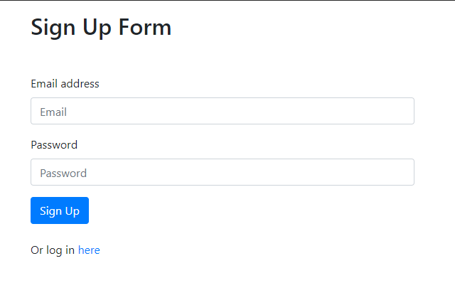
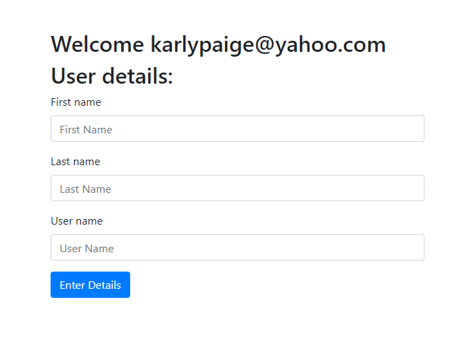
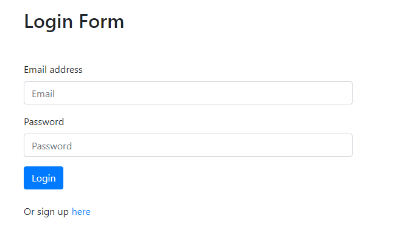
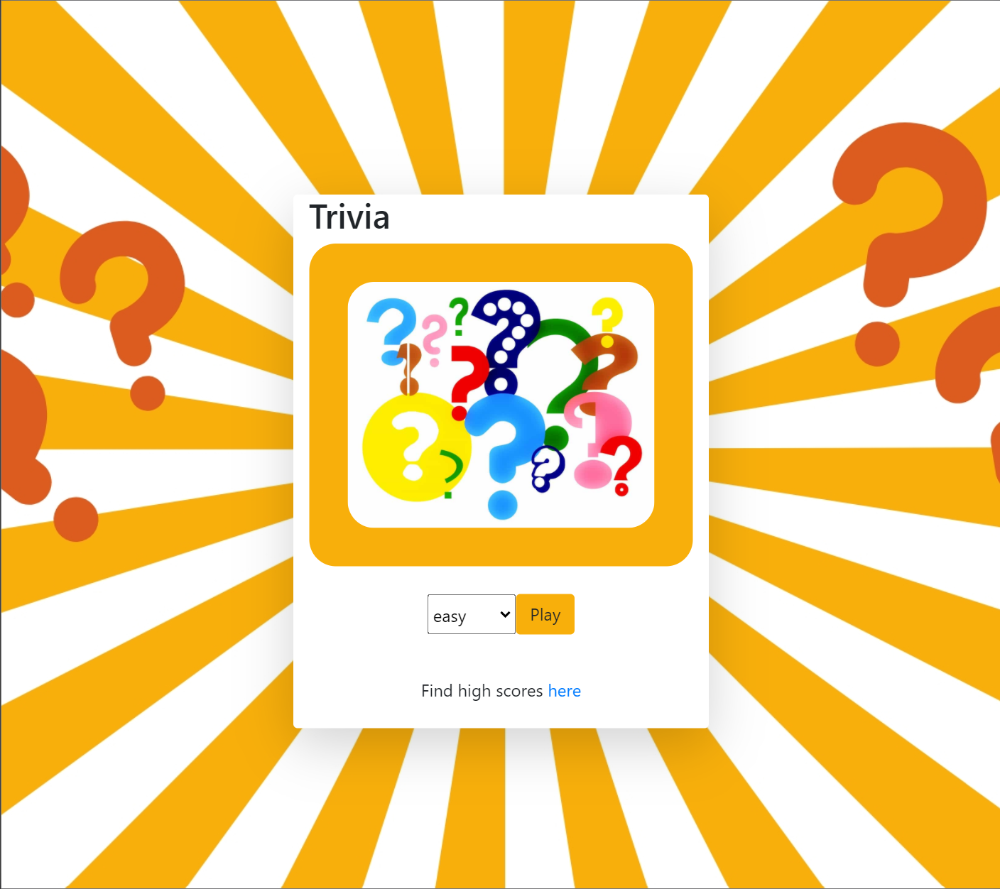
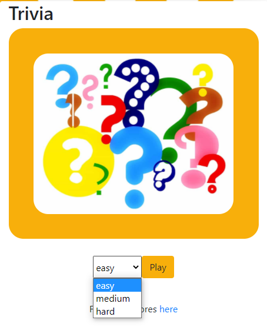
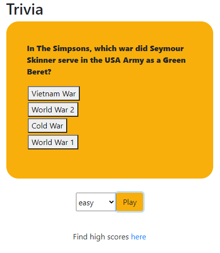
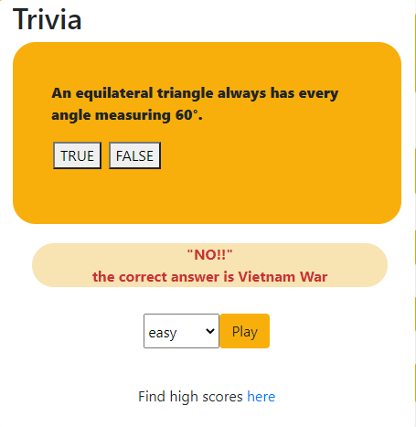
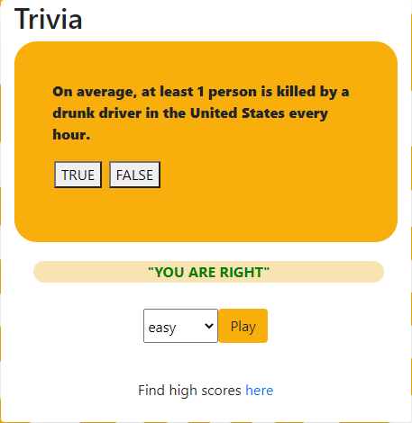
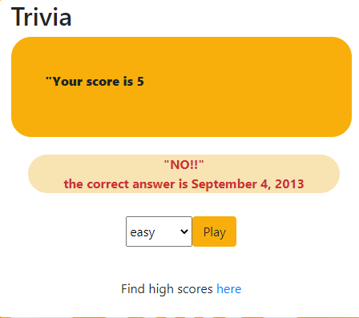
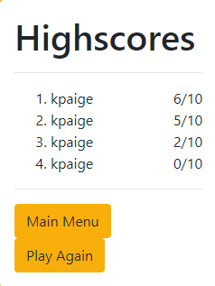

# Project-2-Repository

User has the option to sign up or login:

If they sign up they are rerouted to a User Details page:

Or the user can simply login:

Folloing login or after entering user details user is then routed to the trivia page:

User can select the level of difficulty and is then presented with 10 trivia questions from varying categories to answer:

If the user gives an incorrect anser they are presented with the correct answer and the next question it presented:

Otherwise the message just shows "You are correct" and the next question is presented:

At the end of a ten question session the user is presented with their score for the session:

They then have the option of visiting the "high scores" page where the top 10 scores are presented:

